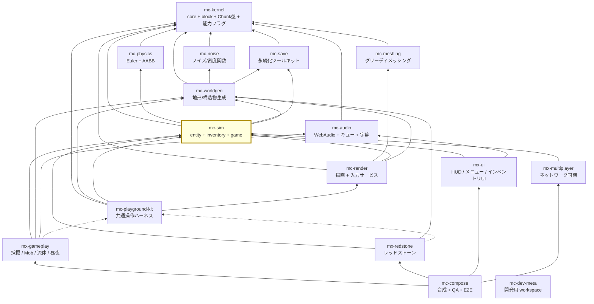

# アーキテクチャ

## 1. 4階層

plan.md §2.2 の 4 階層。**リポジトリ = 検証・リリースの単位**であり、パッケージ（依存境界）や
プレビュー（起動）とは別の単位である（plan.md §2.4。混同しないこと）。

| 階層 | リポジトリ | 性質 |
| --- | --- | --- |
| 安定ライブラリ | kernel / noise / meshing / physics / save / audio | 純粋関数・狭い界面・変更頻度が低い。相互独立で並行構築可能 |
| **基盤** | worldgen / **sim** / render / kit | 状態とサービス（**名詞**）。体験モジュールが乗る土台 |
| 体験モジュール | gameplay / redstone / ui / multiplayer | ルールとUI（**動詞**）。互いを知らず、基盤サービス経由でのみ会話 |
| 合成 | compose | Layerマージ + stage順序表 + E2E。ロジックを持たない |

mc-sim は**基盤**。加えて、基盤の中でも下流数が最大（6リポジトリ）の依存ハブである。

## 2. 依存グラフ全体（16リポジトリ）

実線 = 実行時依存（`dependencies`）、点線 = プレビュー起動時のみ（`devDependencies`）。
`mc-kernel` はどこからでも import 可能なため、矢印は引くが許可リストには書かない。



### 15 と 16 の数え方

plan.md の見出しと §2.4 は「**15 リポジトリで固定**」と書き、§6 Step 0 が別途
`mc-dev-meta` workspace の作成を指示している。つまり:

- **ゲームを構成するリポジトリ = 15**（kernel / noise / meshing / physics / save / audio /
  worldgen / sim / render / kit / gameplay / redstone / ui / multiplayer / compose）
- **依存ホワイトリストが知るべきリポジトリ = 16**（上記 + `mc-dev-meta`）

`REPOSITORY_POLICY.dependencyGraph` は後者の 16 行を持つ。dev-meta は依存を 1 つも持たず
（`repos/` に clone を並べるだけ）、誰からも依存されないため、循環検査には影響しない。
行を置くのは「16 リポジトリ全部について、意図が記録されている」状態にするためである。

`mc-dev-meta` は 15 リポジトリの clone を `repos/` に並べて 1 つの pnpm workspace として
束ねる薄いリポジトリで、開発中は `workspace:*` 解決でモノレポ同等の DX を得る。
npm 公開・バージョン bump 運用は界面安定（APIロック 4 週間無変更）まで開始しない（plan.md §6 Step 0-2）。

このグラフは `scripts/check-dependency-whitelist.ts` の `REPOSITORY_POLICY.dependencyGraph` に
**全 16 行そのまま**記録されており、`pnpm check:deps` が循環検査を行う。
`test/check-dependency-whitelist.test.ts` が「16 行あること」「全体が非循環であること」を assert している。

## 3. mc-sim の位置

### 3.1 親（mc-sim が import してよいもの）

| 依存先 | 何をもらうか |
| --- | --- |
| `mc-kernel` | 共有語彙。**どのリポジトリからも import 可**。ただし `package.json#dependencies` への記載は必要 |
| `mc-physics` | `step(state, world, dt)`、AABBクエリ、voxel-DDA レイキャスト |
| `mc-save` | `defineFormat` / `StoragePort`。mc-sim は自分のセーブフォーマットをこれで**定義する側** |
| `mc-worldgen` | `generateChunk` / `BiomeService` / `ChunkManager` |

### 3.2 子（mc-sim に依存するもの）— 6リポジトリ

`mc-render` / `mc-playground-kit` / `mx-gameplay` / `mx-redstone` / `mx-ui` / `mx-multiplayer`。

これが plan.md §8 の第2リスク「mc-sim のAPIが揺れて全下流に波及」の実体である。
対策は **APIロックファイルを最初から適用**し、公開APIの変更を明示的なレビュー対象にすること
（plan.md §6 Step 0-3 / §9 未決: ツール選定は api-extractor 相当の Effect-TS 互換手段）。

### 3.3 推移閉包は禁止

`mc-sim → mc-worldgen → mc-noise` だが、**mc-sim は mc-noise を import できない**。
地形の値は `Chunk` として mc-worldgen の API 経由で来るべきであり、mc-sim がノイズ関数から
再導出すると「ある座標に何があるか」の実装が 2 つになって必ず食い違う。
`test/check-dependency-whitelist.test.ts` の `transitive-import` 回帰テストがこれを固定している。

同様に `mc-sim → mc-save` はあるが、`mc-save → mc-kernel` の推移で得られるものは無い（kernel は例外）。

## 4. 構成の成立条件（plan.md §2.3）

### 4.1 §2.3-1 基盤 = 名詞、体験 = 動詞

**mc-sim には「状態の置き場」だけを置き、「ルール」は置かない。**

| 置く（名詞） | 置かない（動詞。mx-gameplay 等へ） |
| --- | --- |
| `InventoryService`（スタックの置き場） | 「掘ったらドロップしてインベントリに入る」 |
| `PlayerService`（姿勢・体力・空腹の置き場） | 「クリーパーが爆発してダメージを与える」 |
| `TimeService`（時刻の置き場） | 「夜になったら Mob がスポーンする」 |
| `EntityManager`（エンティティの置き場） | 「エンダーマンがテレポートする」 |

この分離が成り立つと、体験モジュール間の依存エッジがゼロになる。
「採掘 → インベントリに入る」は mx-gameplay が mc-sim の `InventoryService` を叩くだけであり、
mx-gameplay が mx-ui を知る必要はない。逆にここにルールを書き始めると、
mx-gameplay と mx-ui が mc-sim 経由で暗黙に結合し、参照実装の合成層（13k LOC のルール堆積）が再来する。

判断に迷ったときの問い: **「この処理を消したらゲームのルールが変わるか、それとも状態が消えるだけか」**。
ルールが変わるなら体験モジュール側である。

### 4.2 §2.3-2 mc-playground-kit は devDependency 専用

kit は「ミニ世界 + カメラ + レンダラ + 入力を1秒で束ねる糊」であり、**出荷ビルドには入らない**。
したがって:

- **実行時入力サービスは mc-render が所有する。** kit に入力を置くと、kit を含まない本番ゲームから
  入力処理が丸ごと消える。
- mx-gameplay / mx-redstone は kit を `devDependencies` にだけ書く。
- **mc-sim は kit に依存しない**（実行時にも devDependency にも）。mc-sim のシナリオテストは
  Node で決定論的に走るのが要件（plan.md §3.8 検証）であり、ブラウザハーネスを必要としない。

強制は `scripts/check-dependency-whitelist.ts` の `DEV_ONLY_PACKAGES` で行う:

| 違反 | 検出ルール |
| --- | --- |
| `dependencies` に kit がある | `dev-only-package-in-dependencies` |
| `index.ts` / `domain/` / `application/` から kit を import | `dev-only-package-in-shipped-source` |

kit は実行時エッジを作らないため、依存グラフの行としては循環に参加しない。

### 4.3 §2.3-3 stage 実行順序表は compose が唯一所有

各モジュールは `StageRegistration` で**順序制約（`after`）を宣言するだけ**であり、
全順序は mc-compose が解決する（plan.md §4.1 / §4.2）。

```typescript
interface StageRegistration {
  readonly id: StageId
  readonly after?: ReadonlyArray<StageId>   // 制約の宣言のみ
  readonly run: (dt: DeltaTimeSecs) => Effect.Effect<void, never, FrameServices>
}
```

標準 stage 順序（compose が所有する全順序の骨格、plan.md §4.2）:

```
input → simulation(physics → interactions → entities → fluids → redstone → time/weather)
      → camera-mirror → chunk-sync → render → post-fx → hud-sync
```

**mc-sim はこの表を持たない。** `application/game-loop.ts` は
「1 フレーム分のハンドラを 1 個受け取って daemon で回す」だけであり、そのハンドラの中身が
何段あってどういう順かは知らない。順序表を mc-sim に置くと、mx-gameplay の新 stage を足すたびに
mc-sim を変更することになり、依存ハブの API が揺れる原因が 1 つ増える。

`camera-mirror` が `simulation` の**後**にあることに注意。これが §5 のカメラ所有権の
実行順序上の表現である。

### 4.4 §2.3-4 プレビューは検証対象と同居

mc-sim の内蔵プレビューは**障害物コース**（歩く / 泳ぐ / 跳ぶ / スニークを操作確認）であり、
`apps/preview-*/` に置く（plan.md §4.1 末尾。プレビューはモジュール契約に含めない）。
UI だけの独立リポジトリは作らない。

## 5. カメラ所有権の反転（本リポジトリ最大の設計変更）

plan.md §5.1-2「カメラ姿勢は sim 所有」。詳細と参照実装の証跡は
[design-notes.md](./design-notes.md) の DN-01 にある。ここでは構造だけ述べる。

```
【参照実装（誤り）】                    【新設計】
  sim ──yaw/pitch──▶ THREE.Camera       sim ──CameraPoseSnapshot──▶ render
   ▲                      │                                          │
   └──position/direction──┘                                     THREEカメラへ
       （13箇所が読み戻す）                                   ミラーするだけ（書き戻し無し）
```

新設計が構造的に保証される理由は**依存の向き**である。`mc-render → mc-sim` があるため、
`mc-sim → mc-render` は循環になり `pnpm check:deps` が落とす。
mc-sim には「レンダラに問い合わせる」という選択肢がそもそも存在しない。

## 6. リポジトリ内 workspace（未実装）

plan.md §3.8 内部構成: `entity` / `inventory` / `game` 相当を**リポジトリ内 workspace** で分割し、
一方向依存（entity → inventory → game）に整流する。別リポジトリ化はしない（plan.md §5.3:
「依存ハブでありAPIが揺れる間は昇格させない」）。

現状のスケルトンは `domain/` + `application/` の 2 層のみ。workspace 分割は
実装量が閾値を超えた時点で行う。分割しても**リポジトリの数は 15 のまま**である（plan.md §2.4）。
